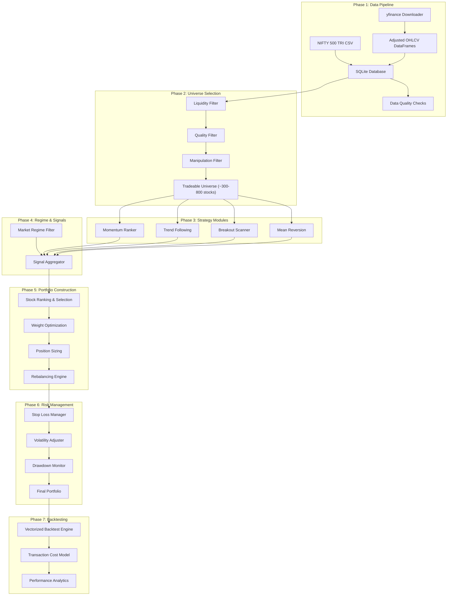

# Systematic Trading System for Indian Equities

A Python-based quantitative trading and investing system that scans the entire NSE/BSE universe, applies multiple strategy modules, constructs diversified portfolios, and backtests with institutional-grade rigor.

---

## Decisions Confirmed

> [!NOTE]
> **Data Source (V1)**: `yfinance` for rapid prototyping. Stocks fetched as `SYMBOL.NS` (e.g., `RELIANCE.NS`). Survivorship bias is accepted for V1. Bhavcopy-based pipeline (survivorship-bias-free) will be added in V2 if results are promising.

> [!NOTE]
> **Benchmark**: NIFTY 500 TRI. User will download historical TRI CSVs from the [NSE Indices Historical Data](https://www.niftyindices.com/reports/historical-data) portal. The system will load and parse these CSVs as the benchmark reference.

> [!NOTE]
> **Stock Universe (V1)**: Current NIFTY 500 constituents. The list will be sourced from NSE (CSV download). Historical constituent lists deferred to V2.

> [!NOTE]
> **Brokerage**: All major Indian brokers now charge brokerage on delivery trades. The cost model uses ₹20/order flat fee (standard discount broker rate).

---

## Open Questions

All questions resolved. ✅

> [!NOTE]
> **Capital**: ₹1,00,000 (₹1 lakh). Position sizing and cost models calibrated for small-capital retail.

> [!NOTE]
> **Rebalancing**: Both weekly and monthly will be backtested. The system will compare results and recommend the better frequency based on net-of-cost performance.

> [!NOTE]
> **Portfolio Size**: Default 15 stocks. Backtesting will also test 5, 10, and 20 stock portfolios to find the optimal size for ₹1L capital.

> [!NOTE]
> **Historical Depth**: 15 years (~2011–2026). Covers the 2013 taper tantrum, 2016 demonetization, 2018 IL&FS crisis, 2020 COVID crash, and 2022 rate hike cycles.

> [!WARNING]
> **Small Capital Cost Impact**: With ₹1L capital and 15 stocks, each position is ~₹6,667. At this size:
> - ₹20 brokerage = **0.30%** per side (vs. 0.02% for a ₹1L order)
> - ₹15.93 DP charge on sell = **0.24%** per scrip
> - Fixed costs alone: **~0.84% round-trip** per position (before STT, slippage)
> - This makes turnover extremely expensive — monthly rebalancing may strongly outperform weekly
> - **Fewer, larger positions (5–10 stocks) may be more cost-efficient** — backtesting will reveal this

---

## Architecture Overview



---

## Proposed Changes

### Phase 1 — Data Pipeline

The foundation. We use `yfinance` to fetch adjusted OHLCV data for current NIFTY 500 constituents, and load NIFTY 500 TRI data from a user-provided CSV.

#### [NEW] [config.py](file:///c:/Users/VAIBHAV/OneDrive/Desktop/Stocks/new%20quant/config.py)
Central configuration file containing:
- Database paths, data directories
- Date ranges for download
- Transaction cost parameters (STT: 0.1% buy+sell, Stamp Duty: 0.015% buy, Brokerage: ₹20/order flat, DP charges: ₹15.93/scrip sell)
- Strategy hyperparameters with defaults
- Logging configuration
- NIFTY 500 constituents list path
- NIFTY 500 TRI CSV path

#### [NEW] [data/downloader.py](file:///c:/Users/VAIBHAV/OneDrive/Desktop/Stocks/new%20quant/data/downloader.py)
yfinance downloader (V1 primary data source):
- Reads current NIFTY 500 constituents from a local CSV/list
- Downloads adjusted OHLCV data via `yfinance` for each symbol as `SYMBOL.NS`
- Supports configurable date range (default: 10+ years)
- Batch downloading with progress tracking (via `tqdm`)
- Retry logic for failed downloads
- Caches downloaded data to avoid redundant API calls
- Stores data as Parquet files in `data/cache/`
- **V2 placeholder**: Stub for bhavcopy downloader to be added later

#### [NEW] [data/benchmark.py](file:///c:/Users/VAIBHAV/OneDrive/Desktop/Stocks/new%20quant/data/benchmark.py)
NIFTY 500 TRI benchmark loader:
- Loads historical TRI data from user-provided CSV (downloaded from [NSE Indices](https://www.niftyindices.com/reports/historical-data))
- Parses date and TRI value columns
- Computes daily returns from TRI
- Validates data completeness and alignment with trading calendar
- Provides benchmark return series for backtesting comparison

#### [NEW] [data/database.py](file:///c:/Users/VAIBHAV/OneDrive/Desktop/Stocks/new%20quant/data/database.py)
SQLite database manager:
- Schema: `daily_prices` table (date, symbol, open, high, low, close, adj_close, volume)
- Schema: `stock_info` table (symbol, name, sector, industry)
- Schema: `benchmark` table (date, index_name, tri_value, daily_return)
- Upsert logic for incremental updates
- Bulk insert for historical backfill from yfinance DataFrames

#### [NEW] [data/quality.py](file:///c:/Users/VAIBHAV/OneDrive/Desktop/Stocks/new%20quant/data/quality.py)
Data quality assurance:
- Detects and fills missing trading days (holidays vs. genuine gaps)
- Identifies and flags erroneous data points (zero volumes on trading days, negative prices)
- Reports data completeness statistics per stock
- Validates OHLC relationships (Low ≤ Open/Close ≤ High)
- Flags stocks with insufficient history (< minimum required lookback)

---

### Phase 2 — Universe Selection & Filtering

How professionals select their tradeable universe. This is critical for avoiding garbage-in-garbage-out.

#### [NEW] [universe/filters.py](file:///c:/Users/VAIBHAV/OneDrive/Desktop/Stocks/new%20quant/universe/filters.py)

**Liquidity Filters** (applied daily, rolling):
```
1. Minimum Average Daily Turnover (ADTV): ₹50 lakh over trailing 20 days
   — Ensures you can enter/exit positions without excessive slippage
2. Minimum trading days: Stock must have traded on ≥90% of trading days in last 60 days
   — Eliminates suspended / rarely-traded stocks
3. Minimum price: ₹10 (avoids penny stocks with extreme volatility)
4. Maximum price: ₹50,000 (practical position sizing for retail capital)
```

**Quality / Anti-Manipulation Filters**:
```
5. No upper/lower circuit hits: Stock must not have hit circuit limits on >5% of days in last 20 days
   — Stocks stuck at circuits can't be traded; manipulated stocks often show circuit patterns
6. Bid-ask spread proxy: (High-Low)/Close < 10% on average over 20 days
   — Extremely wide spreads indicate illiquidity or manipulation
7. Volume consistency: StdDev(Volume) / Mean(Volume) < 3.0 over 60 days
   — Eliminates stocks with operator-driven volume spikes
8. Market cap filter: Exclude stocks with implied market cap < ₹100 Cr
   — Approximated as Close × (total shares from NSE corporate filing, or estimated from bhavcopy)
```

**Series Filter**:
```
9. Only EQ series (regular equity delivery)
   — Excludes BE (books closed), BZ (Z-group), SM (SME), etc.
```

#### [NEW] [universe/universe_builder.py](file:///c:/Users/VAIBHAV/OneDrive/Desktop/Stocks/new%20quant/universe/universe_builder.py)
- Constructs tradeable universe for each rebalancing date
- Point-in-time: only uses information available as of that date (no look-ahead bias)
- Logs universe size over time (expect 300-800 stocks passing all filters)
- Supports "graduated" universe tiers (Tier 1: >₹5Cr ADTV, Tier 2: ₹1-5Cr, Tier 3: ₹50L-1Cr)

---

### Phase 3 — Strategy Modules

Four independent alpha generators. Each produces a ranked score for every stock in the universe.

#### [NEW] [strategies/momentum.py](file:///c:/Users/VAIBHAV/OneDrive/Desktop/Stocks/new%20quant/strategies/momentum.py)

**Cross-Sectional Momentum** (Jegadeesh & Titman style, adapted for India):
```python
# Core signal: 12-month return, skipping the most recent 1 month (12-1 momentum)
# The skip-month avoids short-term mean-reversion noise
momentum_score = returns(252 trading days) - returns(21 trading days)

# Enhancements:
# 1. Risk-adjusted momentum: momentum_score / rolling_volatility(63 days)
# 2. Multi-horizon: blend 3-month, 6-month, 12-month momentum
# 3. Acceleration filter: prefer stocks where 3M momentum > 6M momentum (accelerating)
```

**Scoring**: Percentile rank across universe (0-100). Higher = stronger momentum.

#### [NEW] [strategies/trend_following.py](file:///c:/Users/VAIBHAV/OneDrive/Desktop/Stocks/new%20quant/strategies/trend_following.py)

**Trend Following** (systematic trend identification):
```python
# Signal 1: Price vs. Moving Average
# Stock must be above its 50-day AND 100-day EMA
trend_signal_1 = (close > ema_50) & (close > ema_100)

# Signal 2: Moving Average Slope
# 50-day EMA must be rising (slope > 0 over last 10 days)
trend_signal_2 = slope(ema_50, 10) > 0

# Signal 3: ADX filter (Average Directional Index)
# ADX > 20 confirms a trending environment (vs. range-bound)
trend_signal_3 = adx(14) > 20

# Composite trend score: weighted combination
trend_score = 0.4 * trend_signal_1 + 0.3 * trend_signal_2 + 0.3 * trend_signal_3
```

#### [NEW] [strategies/breakout.py](file:///c:/Users/VAIBHAV/OneDrive/Desktop/Stocks/new%20quant/strategies/breakout.py)

**Volatility Breakout / Range Expansion**:
```python
# Donchian Channel Breakout (adapted):
# Buy signal when price breaks above the highest high of N days
# Combined with volume confirmation

# Signal: Price breaks N-day high with above-average volume
breakout_signal = (close >= highest_high(N=55)) & (volume > sma(volume, 20) * 1.5)

# Consolidation filter: ATR(20) / Close < threshold
# Tighter consolidation before breakout = stronger signal
consolidation = atr(20) / close  # Lower values = tighter consolidation

# Score: Breakout recency × volume surge × consolidation tightness
```

#### [NEW] [strategies/mean_reversion.py](file:///c:/Users/VAIBHAV/OneDrive/Desktop/Stocks/new%20quant/strategies/mean_reversion.py)

**Mean Reversion** (buy the dip in uptrending stocks):
```python
# KEY INSIGHT: Pure mean reversion is dangerous. We only mean-revert within an uptrend.

# Step 1: Confirm uptrend (200-day SMA rising, price > 200 SMA)
uptrend = (close > sma_200) & (slope(sma_200, 20) > 0)

# Step 2: Identify short-term oversold condition
# RSI(5) < 30 OR price is > 2 ATR below its 20-day mean
oversold = (rsi(5) < 30) | (close < sma_20 - 2 * atr(20))

# Step 3: Mean reversion score
# Only generate signals when uptrend AND oversold
mr_score = uptrend & oversold
# Rank by distance from 20-day mean (more oversold = higher score)
```

> [!NOTE]
> Mean reversion has a different holding profile (~3-7 days) vs. momentum (~20-60 days). The portfolio constructor will handle blending these different horizons.

---

### Phase 4 — Market Regime Detection

#### [NEW] [regime/regime_filter.py](file:///c:/Users/VAIBHAV/OneDrive/Desktop/Stocks/new%20quant/regime/regime_filter.py)

Detects the current market regime and adjusts strategy weights accordingly:

```python
# Regime classification using Nifty 50 as market proxy:

# BULL: Nifty > 200 SMA AND 50 SMA > 200 SMA AND ADX > 20
#   → Full allocation, favor momentum & breakout
#   → Portfolio: 40% Momentum, 30% Trend, 20% Breakout, 10% Mean Reversion

# NEUTRAL: Nifty > 200 SMA BUT 50 SMA < 200 SMA (or ADX < 20)
#   → Reduced allocation (70% of capital), favor trend following
#   → Portfolio: 20% Momentum, 40% Trend, 10% Breakout, 30% Mean Reversion

# BEAR: Nifty < 200 SMA AND 50 SMA < 200 SMA
#   → Minimal allocation (30% of capital), cash-heavy, only mean reversion
#   → Portfolio: 0% Momentum, 20% Trend, 0% Breakout, 30% Mean Reversion, 50% Cash

# Additional inputs:
# - Market breadth: % of stocks above their 200 SMA (>60% = bullish, <30% = bearish)
# - VIX level: India VIX > 25 = elevated volatility → reduce position sizes
# - Advance/Decline ratio from bhavcopy data
```

---

### Phase 5 — Portfolio Construction

#### [NEW] [portfolio/ranker.py](file:///c:/Users/VAIBHAV/OneDrive/Desktop/Stocks/new%20quant/portfolio/ranker.py)

Composite ranking system:
```python
# Aggregate scores from all strategy modules
# Each strategy produces a percentile rank (0-100)

composite_score = (
    regime_weight_momentum * momentum_percentile +
    regime_weight_trend * trend_percentile +
    regime_weight_breakout * breakout_percentile +
    regime_weight_meanrev * meanrev_percentile
)

# Select top N stocks (N = target portfolio size, default 20)
# Apply sector diversification: max 25% in any single sector
# Apply liquidity tier weighting: Tier 1 stocks get 1.5x weight preference
```

#### [NEW] [portfolio/constructor.py](file:///c:/Users/VAIBHAV/OneDrive/Desktop/Stocks/new%20quant/portfolio/constructor.py)

Portfolio weight optimization:
```python
# Method 1 (Default): Inverse Volatility Weighting
# Each stock's weight ∝ 1 / σ (realized volatility over 63 days)
# Normalised so weights sum to target allocation (based on regime)

# Method 2 (Advanced): Risk Parity
# Each stock contributes equally to portfolio risk
# Iterative optimization using scipy.optimize

# Method 3 (Simple): Equal Weight
# All selected stocks get equal weight

# Constraints:
# - Max single stock weight: 8%
# - Max sector weight: 25%
# - Min stock weight: 1% (below this, don't bother — transaction costs dominate)
# - Liquidity constraint: position size < 5% of stock's 20-day avg daily volume
```

#### [NEW] [portfolio/position_sizing.py](file:///c:/Users/VAIBHAV/OneDrive/Desktop/Stocks/new%20quant/portfolio/position_sizing.py)

```python
# Volatility-based position sizing:
# position_value = (portfolio_risk_budget / N_stocks) / (stock_ATR_pct * risk_multiplier)
# where ATR_pct = ATR(20) / Close

# Kelly Criterion (half-Kelly for safety):
# f* = 0.5 * (win_rate - (1 - win_rate) / (avg_win / avg_loss))
# Capped at max_position_weight

# Small Capital Mode (₹1L):
# Capital = ₹1,00,000, N_stocks = 15
# Per-stock allocation = ₹6,667 (equal weight)
# At ₹500/share → 13 shares → actual position = ₹6,500
# Must round to whole shares (no fractional shares in India)
# Minimum position = 1 share of any stock

# Backtest parameter grid for portfolio size:
# N_stocks ∈ [5, 10, 15, 20] — test all, pick best net-of-cost
# Rebalancing ∈ [weekly, bi-weekly, monthly] — test all
```

---

### Phase 6 — Risk Management

#### [NEW] [risk/risk_manager.py](file:///c:/Users/VAIBHAV/OneDrive/Desktop/Stocks/new%20quant/risk/risk_manager.py)

```python
# Individual Stock Risk:
# - Trailing stop: 2.5 × ATR(20) below entry price or recent high
# - Time stop: Exit after max_hold_days (60 days for momentum, 10 for mean reversion)
# - Profit target: Optional, 3 × ATR for mean reversion trades

# Portfolio-Level Risk:
# - Max portfolio drawdown threshold: -15% → reduce all positions by 50%
# - Max portfolio drawdown threshold: -25% → liquidate all positions
# - Max daily loss: -3% → halt new entries for 5 days
# - Correlation check: avoid holding >3 stocks from same sector

# Volatility Scaling:
# - When India VIX > 25: reduce position sizes by 30%
# - When India VIX > 35: reduce position sizes by 60%
# - Scale inversely with recent portfolio volatility
```

#### [NEW] [risk/rebalancer.py](file:///c:/Users/VAIBHAV/OneDrive/Desktop/Stocks/new%20quant/risk/rebalancer.py)

```python
# Rebalancing logic — BOTH weekly and monthly tested via backtesting:
# 
# Backtest configs:
# - WEEKLY: rebalance every Friday
# - BI-WEEKLY: rebalance every 2nd Friday  
# - MONTHLY: rebalance on 1st trading day of month
#
# For each rebalance date:
# 1. Run universe selection → tradeable universe
# 2. Run all strategy modules → composite scores
# 3. Run portfolio constructor → target portfolio
# 4. Compare target vs. current holdings
# 5. Generate trades:
#    - SELL: stocks no longer in target, or weight decreased significantly (>3% drift)
#    - BUY: new entries to target, or weight increased significantly
#    - HOLD: stocks still in target with minor weight changes (<3% drift)
# 
# Buffer zone to reduce turnover:
# - A stock must drop below rank N+10 to be removed (not just below N)
# - This "buffer" prevents whipsaw at the boundary
#
# Turnover budget: Critical at ₹1L capital
# - Each round-trip trade costs ~₹56 in fixed fees alone (₹20 buy + ₹20 sell + ₹15.93 DP)
# - Target: minimize turnover while capturing alpha
# - Report net-of-cost Sharpe for each rebalancing frequency
```

---

### Phase 7 — Transaction Cost & Slippage Model

#### [NEW] [costs/cost_model.py](file:///c:/Users/VAIBHAV/OneDrive/Desktop/Stocks/new%20quant/costs/cost_model.py)

Realistic Indian market cost model (updated: brokers now charge delivery brokerage):
```python
# Fixed costs (per transaction):
STT_RATE = 0.001          # 0.1% on both buy and sell (delivery)
STAMP_DUTY_BUY = 0.00015  # 0.015% on buy side only
EXCHANGE_CHARGES = 0.00003 # ~0.003% both sides (NSE)
SEBI_FEE = 0.000001       # 0.0001% both sides
GST_RATE = 0.18           # 18% on (brokerage + exchange charges)
BROKERAGE_PER_ORDER = 20  # ₹20 flat per executed order (all discount brokers now charge this)
DP_CHARGES = 15.93        # ₹15.93 per scrip on sell (flat)

# Brokerage as % depends on order size:
# ₹20 on a ₹6,667 order (₹1L / 15 stocks) = 0.30%  ← YOUR SCENARIO
# ₹20 on a ₹10,000 order (₹1L / 10 stocks) = 0.20%
# ₹20 on a ₹20,000 order (₹1L / 5 stocks) = 0.10%
# ₹20 on a ₹50,000 order = 0.04%
# Modeled as: brokerage_pct = min(BROKERAGE_PER_ORDER / order_value, 0.025)

# Total fixed cost ≈ 0.26-0.30% round-trip (including brokerage)

# Slippage model (variable, depends on liquidity tier):
# Tier 1 (ADTV > ₹5Cr):    0.05% per side
# Tier 2 (ADTV ₹1-5Cr):    0.10% per side
# Tier 3 (ADTV ₹50L-1Cr):  0.20% per side

# Impact cost: For positions > 1% of daily volume
# impact_cost = 0.1% * sqrt(position_value / avg_daily_value)

# Total round-trip cost estimate:
# Large-cap:  0.28% + 0.10% = ~0.38%
# Mid-cap:    0.28% + 0.20% = ~0.48%
# Small-cap:  0.28% + 0.40% = ~0.68%
```

---

### Phase 8 — Backtesting Engine

#### [NEW] [backtest/engine.py](file:///c:/Users/VAIBHAV/OneDrive/Desktop/Stocks/new%20quant/backtest/engine.py)

Vectorized backtesting engine (custom-built for portfolio strategies):

```python
# Design choices:
# - Vectorized (not event-driven) for speed across 500+ stocks × 15 years
# - Point-in-time data: all lookbacks use only data available as of signal date
# - No look-ahead bias: signals on day T, execution on day T+1 at Open price
# - T+1 settlement modeled: sold capital not available until next day

# Core loop (pseudo-code):
# for each rebalance_date in schedule:
#     universe = build_universe(date)  # point-in-time
#     scores = compute_all_strategies(universe, date)
#     regime = detect_regime(date)
#     target = construct_portfolio(scores, regime)
#     trades = calculate_rebalance_trades(current_portfolio, target)
#     costs = calculate_costs(trades)
#     execute_trades(trades, costs)  # at next day's open + slippage
#     
# between rebalance dates:
#     check_stop_losses(daily)
#     update_portfolio_value(daily)
#     check_drawdown_limits(daily)
```

#### [NEW] [backtest/anti_overfit.py](file:///c:/Users/VAIBHAV/OneDrive/Desktop/Stocks/new%20quant/backtest/anti_overfit.py)

Anti-overfitting measures:
```python
# 1. Walk-Forward Optimization:
#    - Split data into rolling windows (e.g., 3-year train, 1-year test)
#    - Optimize parameters on train, validate on test
#    - Report ONLY out-of-sample results

# 2. Combinatorial Purged Cross-Validation (CPCV):
#    - More sophisticated than simple train/test split
#    - Accounts for time-series dependencies

# 3. Parameter Stability:
#    - Test strategy with ±20% parameter variation
#    - If performance collapses, parameters are overfit

# 4. Deflated Sharpe Ratio:
#    - Adjusts Sharpe for the number of strategies tested
#    - If you tested 100 parameter combos, your "best" Sharpe is inflated

# 5. Minimum Backtest Length (MBL):
#    - For Sharpe 1.0, need minimum ~5 years of data
#    - For Sharpe 0.5, need minimum ~20 years

# 6. Survivorship Bias Check:
#    - Run backtest with and without delisted stocks
#    - Report the difference
```

---

### Phase 9 — Performance Analytics

#### [NEW] [analytics/metrics.py](file:///c:/Users/VAIBHAV/OneDrive/Desktop/Stocks/new%20quant/analytics/metrics.py)

```python
# Core Metrics:
# - CAGR (Compound Annual Growth Rate)
# - Sharpe Ratio (annualized, using risk-free rate = 6% for India)
# - Sortino Ratio (penalizes only downside volatility)
# - Max Drawdown (peak-to-trough)
# - Max Drawdown Duration (time to recover)
# - Calmar Ratio (CAGR / Max Drawdown)
# - Win Rate (% of profitable trades)
# - Profit Factor (gross profit / gross loss)
# - Average Win / Average Loss ratio
# - Portfolio Turnover (monthly, annualized)
# - Beta to Nifty 500 TRI
# - Alpha (Jensen's alpha)
# - Information Ratio (active return / tracking error)

# Rolling Metrics:
# - Rolling 1-year returns
# - Rolling Sharpe (252-day window)
# - Rolling drawdown

# Distribution Analysis:
# - Monthly returns histogram
# - Return distribution vs. normal (skewness, kurtosis)
# - Worst N months
# - Best N months
```

#### [NEW] [analytics/visualizer.py](file:///c:/Users/VAIBHAV/OneDrive/Desktop/Stocks/new%20quant/analytics/visualizer.py)

Matplotlib/Plotly charts:
- Equity curve (strategy vs. NIFTY 500 TRI benchmark)
- Drawdown chart
- Monthly returns heatmap
- Rolling Sharpe ratio
- Sector allocation over time
- Turnover chart
- Distribution of individual trade returns

---

### Phase 10 — Main Entry Points & Utilities

#### [NEW] [main.py](file:///c:/Users/VAIBHAV/OneDrive/Desktop/Stocks/new%20quant/main.py)
Main orchestrator script:
- `python main.py download` — Download/update price data via yfinance
- `python main.py backtest` — Run full backtest
- `python main.py scan` — Run strategies on latest data, show current signals
- `python main.py report` — Generate performance report

#### [NEW] [utils/indicators.py](file:///c:/Users/VAIBHAV/OneDrive/Desktop/Stocks/new%20quant/utils/indicators.py)
Technical indicator library (vectorized with NumPy/Pandas):
- SMA, EMA, WMA
- RSI, ADX, ATR
- Donchian Channels
- Bollinger Bands
- Rate of Change, Slope calculations
- All implemented as pure functions operating on pandas Series

#### [NEW] [utils/helpers.py](file:///c:/Users/VAIBHAV/OneDrive/Desktop/Stocks/new%20quant/utils/helpers.py)
Utility functions for date handling, logging, etc.

#### [NEW] [requirements.txt](file:///c:/Users/VAIBHAV/OneDrive/Desktop/Stocks/new%20quant/requirements.txt)
```
pandas>=2.0
numpy>=1.24
scipy>=1.10
matplotlib>=3.7
plotly>=5.15
requests>=2.31
yfinance>=0.2.28
tqdm>=4.65
sqlite3  # built-in
```

---

## Project Structure

```
new quant/
├── config.py                    # All configuration & hyperparameters
├── main.py                      # CLI entry point
├── requirements.txt             # Dependencies
│
├── data/                        # Phase 1: Data Pipeline
│   ├── __init__.py
│   ├── downloader.py            # yfinance downloader (V1)
│   ├── benchmark.py             # NIFTY 500 TRI CSV loader
│   ├── database.py              # SQLite manager
│   ├── nifty500_constituents.csv # Current NIFTY 500 stock list
│   └── quality.py               # Data quality checks
│
├── universe/                    # Phase 2: Universe Selection
│   ├── __init__.py
│   ├── filters.py               # Liquidity, quality, manipulation filters
│   └── universe_builder.py      # Point-in-time universe construction
│
├── strategies/                  # Phase 3: Alpha Generation
│   ├── __init__.py
│   ├── base.py                  # Abstract base strategy class
│   ├── momentum.py              # Cross-sectional momentum
│   ├── trend_following.py       # Trend following signals
│   ├── breakout.py              # Volatility breakout
│   └── mean_reversion.py        # Mean reversion in uptrends
│
├── regime/                      # Phase 4: Market Regime
│   ├── __init__.py
│   └── regime_filter.py         # Bull/Neutral/Bear detection
│
├── portfolio/                   # Phase 5: Portfolio Construction
│   ├── __init__.py
│   ├── ranker.py                # Composite stock ranking
│   ├── constructor.py           # Weight optimization
│   └── position_sizing.py       # Volatility-based sizing
│
├── risk/                        # Phase 6: Risk Management
│   ├── __init__.py
│   ├── risk_manager.py          # Stop losses, drawdown limits
│   └── rebalancer.py            # Rebalancing engine
│
├── costs/                       # Phase 7: Transaction Costs
│   ├── __init__.py
│   └── cost_model.py            # STT, slippage, impact cost model
│
├── backtest/                    # Phase 8: Backtesting
│   ├── __init__.py
│   ├── engine.py                # Vectorized backtest engine
│   └── anti_overfit.py          # Walk-forward, parameter stability
│
├── analytics/                   # Phase 9: Performance Analytics
│   ├── __init__.py
│   ├── metrics.py               # CAGR, Sharpe, drawdown, etc.
│   └── visualizer.py            # Charts and reports
│
└── utils/                       # Phase 10: Utilities
    ├── __init__.py
    ├── indicators.py            # Technical indicators (vectorized)
    └── helpers.py               # Date handling, logging, misc
```

---

## Realistic Performance Expectations

Based on academic literature and backtests of systematic momentum/trend strategies in Indian equities:

| Metric | Conservative | Moderate | Optimistic |
|:---|:---|:---|:---|
| **CAGR** | 14-16% | 18-22% | 24-28% |
| **Sharpe Ratio** | 0.5-0.7 | 0.7-1.0 | 1.0-1.3 |
| **Max Drawdown** | -20% to -25% | -15% to -20% | -10% to -15% |
| **Win Rate** | 45-50% | 50-55% | 55-60% |
| **Avg Win / Avg Loss** | 1.5-2.0x | 2.0-2.5x | 2.5-3.0x |
| **Monthly Turnover** | 15-25% | 25-40% | 40-60% |
| **Calmar Ratio** | 0.6-0.8 | 1.0-1.5 | 1.5-2.5 |

> [!CAUTION]
> **Reality check**: Nifty 50 has delivered ~12% CAGR over 15 years. Any strategy claiming consistent 30%+ CAGR net of costs is almost certainly overfit. A well-designed systematic strategy should target **15-22% CAGR with a Sharpe of 0.7-1.0 and max drawdown under 20%**. The real edge is in drawdown reduction and consistency, not in raw returns.

> [!WARNING]
> **Survivorship Bias (V1 Limitation)**: Using current NIFTY 500 constituents + yfinance introduces survivorship bias. Backtests using only currently listed stocks typically overstate CAGR by 2-4% per year. This is a known and accepted trade-off for V1 rapid prototyping. **V2 will add a bhavcopy-based pipeline** to eliminate this bias with point-in-time constituent lists and delisted stock data.

---

## Survivorship Bias — Known V1 Limitation

**Why it matters in India specifically:**
1. **High delisting rate**: India has had ~1000+ delistings in the last 15 years (fraud, SEBI action, mergers, voluntary)
2. **Small-cap carnage**: Many small-caps that existed in 2010 no longer exist — and they would have been the worst performers
3. **Index reconstitution**: If you backtest on "current Nifty 500 constituents," you're selecting stocks that survived and grew large enough to be in the index
4. **Quantifying the bias**: Studies show 2-4% annual CAGR inflation for Indian market backtests that ignore survivorship

**V1 approach (accepted trade-off):**
- Use current NIFTY 500 constituents — simple, fast, sufficient for validating strategy logic
- Results will be 2-4% CAGR optimistic — keep this in mind when evaluating

**V2 solution (deferred):**
- Historical bhavcopy data will include all stocks that traded on each date
- Point-in-time universe reconstruction
- Delisted stocks included until last trading day
- Comparative report: V1 (biased) vs V2 (unbiased) results

---

## How to Filter Illiquid/Manipulated Stocks

**Red flags for manipulation in Indian markets:**
1. **Circuit lock patterns**: Stock repeatedly hits 5%/10%/20% upper/lower circuits — common in operator-driven stocks
2. **Volume spikes**: Sudden 10x-50x volume with no news — classic pump-and-dump
3. **Bid-ask spread anomalies**: Consistent wide spreads (>2%) in small-caps
4. **Zero-volume days**: Extended periods of no trading interspersed with sudden activity
5. **Penny stock volatility**: Sub-₹10 stocks with 5-10% daily moves
6. **SEBI surveillance**: Stocks moved to ASM/GSM (Additional Surveillance Measure / Graded Surveillance Measure) lists

**Our filters automatically exclude these** via the liquidity, circuit, volume consistency, and price filters in Phase 2.

---

## Verification Plan

### Automated Tests
```bash
# Unit tests for each module
python -m pytest tests/ -v

# Data quality validation
python main.py validate-data

# Verify yfinance data download for sample stocks
python -c "import yfinance as yf; print(yf.download('RELIANCE.NS', period='5d'))"

# Strategy sanity checks (known-good signals for specific dates)
python -m pytest tests/test_strategies.py -v

# Backtest smoke test (2 years, small universe)
python main.py backtest --start 2023-01-01 --end 2024-12-31 --universe-size 50
```

### Manual Verification
1. **Spot-check signals**: Compare strategy signals against TradingView charts for 10 randomly selected stocks
2. **Cost verification**: Verify transaction cost model against Zerodha/Groww brokerage calculator (including ₹20/order brokerage)
3. **Benchmark comparison**: Compare equity curve shape against NIFTY 500 TRI
4. **Walk-forward results**: Ensure out-of-sample Sharpe > 50% of in-sample Sharpe (if much lower, likely overfit)
5. **Benchmark data validation**: Cross-check TRI CSV values against NSE website for a few random dates

---

## Implementation Order

| Phase | Description | Estimated Effort | Dependencies |
|:---|:---|:---|:---|
| 1 | Config + Data Pipeline + Benchmark Loader | Core foundation | None |
| 2 | Universe Selection | Filtering engine | Phase 1 |
| 3 | Technical Indicators | Utility library | None (parallel with 1) |
| 4 | Strategy Modules | Alpha generation | Phases 1, 2, 3 |
| 5 | Market Regime | Signal modulation | Phase 3 |
| 6 | Portfolio Construction | Weight optimization | Phases 4, 5 |
| 7 | Risk Management | Position protection | Phase 6 |
| 8 | Transaction Cost Model | Realistic costs | Phase 6 |
| 9 | Backtesting Engine | Core simulation | Phases 6, 7, 8 |
| 10 | Analytics & Visualization | Performance reporting | Phase 9 |

We will build Phases 1-3 first (they are independent), then proceed sequentially through 4-10.
